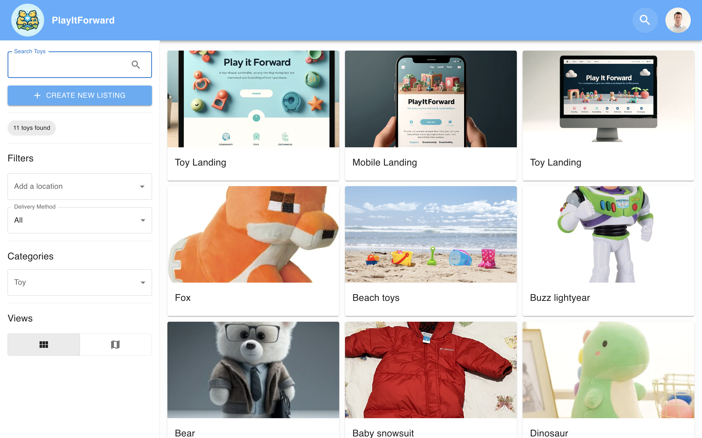

<p align="center">
<a href="https://ffprac-team4-front.onrender.com/">
  
</a>

</p>
<h1 align="center" style="color: #57abff">
  PlayItForward™
</h1>



## Your Personal Community Toy Exchange Assistant

Welcome to **PlayItForward**, the ultimate toy listing application designed to streamline your toy exchange and boost your productivity.

The **PlayItForward** application is an innovative web platform designed to foster a community-driven approach to toy sharing and sustainability. This application serves as a vibrant marketplace where users can give new life to toys, ensuring they are cherished and enjoyed far beyond their initial purchase.

## 📋 Table of Contents

- [Key Features](#key-features)
- [Why Choose Task Minder?](#why-choose-task-minder)
- [Getting Started](#getting-started)
- [Prerequisites](#prerequisites)
- [Installation](#installation)
- [Usage](#usage)
- [Additional Resources](#additional-resources)
- [Acknowledgments](#Acknowledgments)
- [Author](#author)
- [Contact](#contact)
- [License](#license)
- [Feedback](#feedback)

## Key Features

- **Task Management:** Create, edit, and delete toys with ease. Organize them by location, delivery method, or custom categories.

- **API Integration:** Synchronize your items across different platforms and devices, ensuring you're always up to date.

- **Responsive UI Design:** Enjoy a seamless experience on any device, thanks to our adaptive and user-friendly interface.

## Why Choose PlayItForward?

**Simplicity:** Our clean and clutter-free interface makes navigating your toy listing a breeze.

**Efficiency:** With features like map view organization and quick message and add to favorite options, managing your exchange has never been faster.

<a id="getting-started"></a>

## 🚀 Getting Started

To get a local copy up and running follow these steps.

<a id="prerequisites"></a>

### 📦 Prerequisites

- npm

```sh
npm install npm@latest -g
```

> It updates npm to the latest version.

<a id="installation"></a>

### 📥 Installation

- Clone the repo

```sh
SSH:
git clone git@github.com:Code-the-Dream-School/ffprac-team4-front.git

HTTPS:
git clone https://github.com/Code-the-Dream-School/ffprac-team4-front.git
```

- Install NPM packages

```sh
npm install
```

<a id="usage"></a>

### 💡 Usage

To run the application, execute the following command:

```sh
npm run dev
```

The application will open in your default web browser at http://localhost:5173.

> This is a Full Stack application.
> Navigate to [Back End repositoy](https://github.com/Code-the-Dream-School/ffprac-team4-back)

<a id="additional-resources"></a>

## 🎓 Additional Resources

- [React](https://react.dev/)
- [Markdown](https://www.markdownguide.org/)

## Acknowledgments

Special thanks and a shout out to the following individuals and organizations:

- [Code the Dream](https://www.codethedream.org/) for their exceptional coding school, providing valuable learning resources and support.
- Our beloved project manager Gaetan Siry for his guidence, mentorship and countless hours of dedication for the success of our team.
- Hat tip to anyone whose code was used.

<a id="author"></a>

## 👨‍💻 Author

> GitHub:

- Front End:
- [Amir Olyaei](https://github.com/AmirhosseinOlyaei)
- [Hanna Akhramchuk](https://github.com/akhhanna20)
- Doina Fitchevici
- Alevtina Babinskaya
- Back End:
- Betiel Amanuel
- [Rodgers Mora Onchanah](https://www.github.com/morarodgers)

[](https://github.com/AmirhosseinOlyaei?screen_name=AmirhosseinOlyaei)
[](https://github.com/akhhanna20?screen_name=akhhanna20)
[](https://github.com/morarodgers?screen_name=morarodgers)

## Contact

If you have any questions or feedback, feel free to reach out to [DevArts](https://devarts.notion.site/devarts/61c6b79808ce476290c753165851b070?v=9d442848a814451fba7a2e1b99bebb9b).

> LinkedIn:

- [Amir Olyaei](https://www.linkedin.com/in/amirhossein-olyaei)
- [Doina Fitchevici](https://www.linkedin.com/in/doina-fitchevici/)
- [Hanna Akhramchuk](https://www.linkedin.com/in/hanna-akhramchuk-3a9087201/)
- Alevtina Babinskaya
- Betiel Amanuel
- [Rodgers Mora Onchanah](https://www.linkedin.com/in/morarodgers)

<a id="license"></a>

## 📜 License

Distributed under the MIT License. See [`LICENSE`](./LICENSE) for more information.

## Feedback

Your feedback is invaluable to us! If you have any suggestions or run into issues while using **Task Minder**, please open an issue on our GitHub repository. We're committed to making **Task Minder** the best it can be, and your input helps us achieve that goal.

Thank you for choosing **Task Minder** as your to-do list companion. Let's make task management a seamless and productive part of your daily routine!

[](https://ffprac-team4-front.onrender.com)
[](https://github.com/Code-the-Dream-School/ffprac-team4-front/graphs/contributors)
[](https://github.com/Code-the-Dream-School/ffprac-team4-front/network/members)
[](https://github.com/Code-the-Dream-School/ffprac-team4-front/stargazers)
[](https://github.com/Code-the-Dream-School/ffprac-team4-front/issues)
[](./LICENSE)
[](https://github.com/sponsors/AmirhosseinOlyaei)

# Front-End Repo for Node/React Practicum

This will be the front-end for your team's practicum project.

It is suggested that you run these instructions **after** you setup the back-end server first.
You can go through these steps during your first group meeting in case you need assistance from your mentors.

You will have two folders inside one team folder (one for front-end and one for back-end). Name the parent folder something appropriate (in the below example we title it "Practicum Project"). Then clone directly (do not fork and clone) the front and back repos while inside the parent ("Practicum Project") project folder.


> The front-end app (React) will be running on port 3000. The back-end server will be running on port 8000. You will need to run both the front-end app and the back-end server at the same time to test your app.

### Setting up local development environment

1. Clone this repository to the folder that was already created for both the front-end and back-end repos
2. Run `npm install` to install dependencies
3. Pull the latest version of the `main` branch (when needed)
4. Run `npm start` to start the development server
5. Open http://localhost:3000 with your browser to see the data received the back-end server.
6. Now you have your front-end and back-end running locally!

#### Running the front-end server in Visual Studio Code

Note: In the below example, the group's front-end repository was named `bb-practicum-team1-front` and the back-end repository was named `bb-practicum-team-1-back`. Your repository will have a different name, but the rest should look the same.


#### Running the front-end server in the browser


